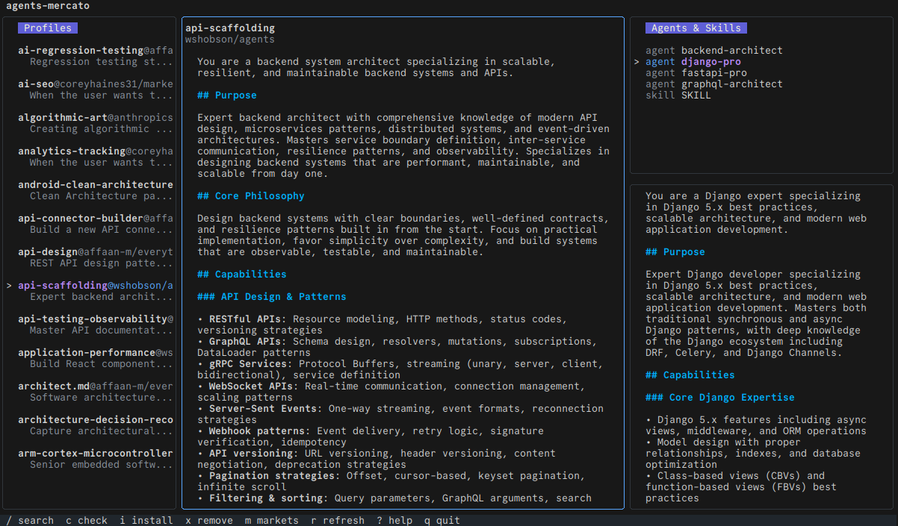

# mct — A package manager for AI coding agents and skills

Think **npm**, but for the agents and skills consumed by Claude Code, Cursor, Windsurf, Codex, Gemini, OpenCode, Copilot, and more.

Install, share, version, and sync agent and skill definitions across your team, your machines, your CI — and across **multiple AI tools at once** — from any Git repository.

<p align="center">
  
</p>

---

## The problem

Agents and skills are becoming a critical part of how teams build software. They define how your AI reviews code, writes tests, refactors, enforces conventions.

But right now, they are:

- scattered across personal `.claude/`, `.cursor/`, `.windsurf/`, `.codex/`… directories
- copy-pasted between projects, teammates, and tools
- duplicated and rewritten for each AI tool you use
- drifting silently when someone edits a file locally
- impossible to discover or reuse across teams
- never in sync between your laptop and CI

Agents and skills are code-adjacent artifacts. They deserve the same tooling as code: versioning, dependencies, distribution, reproducibility — and a single source of truth across tools.

That's what `mct` does.

## The solution

`mct` treats Git repositories as **markets** — sources of agent and skill definitions — and installs them into your project. Each entry is **transformed** at install time into the native format of every AI tool you've enabled.

- **Markets** are Git repos you register as sources
- **Entries** (agents, skills) are installed from markets
- **Transformers** convert each entry into the correct format and location for every enabled tool (Claude, Cursor, Windsurf, Codex, Gemini, OpenCode, Copilot, Supermaven, PearAI, RooCode, Continue)
- **Dependencies** between skills are resolved automatically
- **Drift detection** knows when you've modified an installed file locally
- **Sync** pulls upstream updates and flags conflicts
- **Search** works across all your markets, fully offline
- **Save / Restore** makes your whole setup portable in one file
- **Git hooks** keep your team's setup in sync automatically

No central registry. No server. Just Git.

## Quick example

Register a market and install an agent:

```bash
mct market add team git@github.com:my-org/claude-agents.git
mct add team/profile/agents/reviewer
```

By default, the entry is installed for Claude Code (`.claude/`). Enable other tools to install it everywhere at once:

```bash
mct config set tools.cursor true
mct config set tools.windsurf true
mct add team/profile/skills/code-style
# Writes .claude/skills/code-style/SKILL.md
#        .cursor/rules/code-style.mdc
#        .windsurf/rules/code-style.md
```

Save your setup so the rest of the team (and your CI) can reproduce it:

```bash
mct save
git add .mct.json
git commit -m "add mct setup"
git push
```

Restore on another machine:

```bash
git pull
mct restore
```

Use in CI:

```yaml
- name: Restore agents and skills
  run: mct restore

- name: Run Claude with restored skills
  run: claude -p "Review this PR" --skills ./.claude/skills
```

Your agents and skills are consistent everywhere — every laptop, every tool, every CI runner.

## Features

Real features, all implemented today:

- **Multi-tool installation** — write entries to Claude, Cursor, Windsurf, Codex, Gemini, OpenCode, Copilot, Supermaven, PearAI, RooCode, Continue from a single source
- **Transformers** — entries are converted to each tool's native format (frontmatter, file extension, directory layout) at install time
- **Tool mappings** — translate models (`opus`, `sonnet`, `haiku`) and built-in tool names (`Bash`, `Read`, `Edit`…) to each target tool's equivalent
- **Dependency resolution** — skills can declare `requires_skills`, and `mct` installs the full graph
- **Drift detection** — checksums detect local edits to installed files, so updates never silently overwrite your work
- **Conflict handling** — when a local edit meets an upstream change, `mct` tells you and lets you resolve it
- **Offline BM25 search** with fuzzy matching, across all registered markets
- **Interactive TUI** for browsing markets and managing installations
- **Prune** to handle entries deleted upstream (keep or remove)
- **SSH support** for private repositories (system SSH agent, `~/.ssh/config`, `known_hosts`)
- **JSON output** (`--json`) on most commands for scripting and CI
- **Save / Restore** to a portable `.mct.json` file — share setups across machines and teammates
- **Git hooks** — `mct hook install post-pull` and `mct hook install pre-push` keep `.mct.json` and the local install in sync automatically
- **Self-update** — `mct dist-upgrade` updates the binary; a daily background check notifies you of new releases
- **Tracking metadata** injected into frontmatter (`mct_ref`, `mct_version`, `mct_market`, `mct_installed_at`, `mct_checksum`) so installed files are self-describing

## Install

**Linux / macOS (recommended):**

```bash
curl -fsSL https://raw.githubusercontent.com/JLugagne/agents-mercato/main/install.sh | bash
```

Installs to `~/.local/bin/mct` (no root required). Override with `MCT_INSTALL_DIR=/your/path` or pin a version with `MCT_VERSION=v1.3.9`.

**Go install:**

```bash
go install github.com/JLugagne/agents-mercato/cmd/mct@latest
```

**Self-update:**

```bash
mct dist-upgrade
```

## Supported tools

| Tool       | Agents | Skills | Output location                        |
| ---------- | :----: | :----: | -------------------------------------- |
| Claude     |   ✓    |   ✓    | `.claude/agents/*.md`, `.claude/skills/<name>/SKILL.md` |
| Cursor     |        |   ✓    | `.cursor/rules/<name>.mdc`             |
| Windsurf   |        |   ✓    | `.windsurf/rules/<name>.md`            |
| Codex      |        |   ✓    | `.codex/skills/<name>/SKILL.md`        |
| Gemini     |        |   ✓    | `.gemini/rules/<name>.md`              |
| OpenCode   |   ✓    |   ✓    | `.opencode/agents/`, `.opencode/skills/` |
| Copilot    |        |   ✓    | `.github/copilot-instructions.md`      |
| Continue   |        |   ✓    | `.continue/rules/<name>.md`            |
| Supermaven |        |   ✓    | `.supermavenrules`                     |
| PearAI     |        |   ✓    | `.peairules`                           |
| RooCode    |        |   ✓    | `.roocode.rules`                       |

Only `claude` is enabled by default. Enable others with `mct config set tools.<name> true`.

## Core commands

```bash
# Markets (sources)
mct market add <git-url>          # register a Git repo as a market
mct market list                   # list registered markets
mct market info <name>            # inspect a market
mct market set <name> <key> <val> # update a market property (e.g. branch)
mct market remove <name>

# Install / remove entries
mct add <market>/<path>           # install an agent or skill (with deps)
mct add <market>@<profile>        # install all entries in a profile
mct add <ref> --dry-run
mct remove --ref <market>/<path>

# Sync
mct refresh                       # fetch updates from all markets
mct update                        # apply pending changes locally
mct sync                          # refresh + update
mct check                         # show status of installed entries
mct prune                         # handle entries deleted upstream

# Search
mct search "security review"
mct search "cli" --type skill --installed

# Configuration
mct config get                    # show current config
mct config set tools.cursor true  # enable a tool target
mct config set drift_policy prompt

# Portable setup
mct save                          # write .mct.json in current dir
mct restore                       # reinstall everything from .mct.json
mct export setup.json             # export full setup (markets + entries)
mct import setup.json

# Git hooks
mct hook install post-pull        # auto-restore after git pull
mct hook install pre-push         # auto-save .mct.json before push
mct hook uninstall <name>

# Self-update
mct dist-upgrade

# TUI
mct tui
```

See `mct --help` for the full command list, including `lint`, `conflicts`, `index`, `readme`, and more.

## Why not just use Git?

Git gives you versioned files. It doesn't give you:

- **Multi-tool fan-out** — write the same source entry to Claude, Cursor, Windsurf, and Codex with one command, each in the right format and location
- **Dependency resolution** — when installing a skill, its required skills come along automatically
- **Drift detection** — Git can't tell you that you edited `code-reviewer.md` locally after installing it from a market, and that the upstream has also changed
- **Multi-repo composition** — using agents from three different repos in one project, with consistent updates
- **Offline search across sources** — BM25 + fuzzy, no network calls, no data leaving your machine
- **Reproducible CI** — a single `.mct.json` that pins your markets and installed entries for the whole team

`mct` is built on top of Git. It just makes Git usable for a use case Git wasn't designed for.

## Use cases

**Team workflows** — share reviewers, conventions, and skills across a team via a single private Git repo.

**Mixed-tool teams** — one developer uses Claude Code, another uses Cursor, a third uses Windsurf. Author skills once in a market, install them everywhere with the same `.mct.json`.

**CI automation** — pin your setup in `.mct.json`, run `mct restore` in CI, get reproducible AI-assisted pipelines regardless of which tool runs.

**Multi-machine setups** — keep your personal config in sync across laptop, desktop, and remote dev boxes.

**Enterprise environments** — SSH support and fully local search mean internal agents and skills can be shared without any data leaving the company network.

## Creating a market

A market is just a Git repository with a specific layout. See [MARKET.md](./MARKET.md) for the full spec, examples, and details on tool transformations.

## Roadmap

- Public and private registries
- Semantic versioning and compatibility checks
- Signed entries
- Richer conflict resolution UI in the TUI
- More tool targets as the ecosystem grows

## Scope

`mct` writes a **single source-of-truth entry** (Markdown + YAML frontmatter, the format established by the Claude Code ecosystem) into the **native format of every AI coding tool** you use. The goal is to make agents and skills truly portable across the AI tooling landscape, instead of forcing teams to maintain N copies of the same prompt for N tools.

If your tool isn't supported yet, transformers are small and self-contained — contributions welcome.

## Feedback

Open questions I'd love input on:

- How should conflicts between multiple markets exposing the same entry be handled?
- What belongs in a future `mct` standard vs. what should stay market-specific?
- What's missing for your team or your tool to adopt it?

Issues and discussions welcome.

## License

[MIT](LICENSE)
